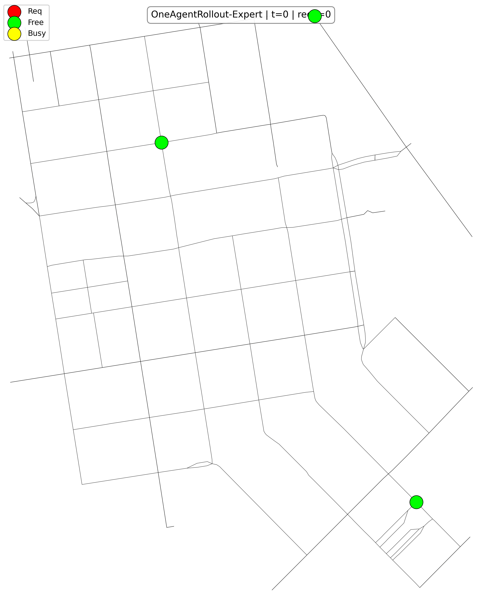

# Multi-Agent Reinforcement Learning for Ride-Hailing Cab Routing

**M.Tech thesis · Indian Institute of Technology Patna · 2026** 
Tarun Mandal · Supervisor: Dr. Arijit Mondal · [LinkedIn](https://www.linkedin.com/in/tarun-mandal-86959b1a7) · [Defence slides (PDF)](MARL_for_Cab_Routing__3_%20(1).pdf)

## Problem statement

Ride-hailing platforms must keep deciding where idle cabs should go while requests appear unpredictably across a city.

> Given a fleet of N cabs on an urban road network and ride requests that arrive stochastically at random pickup points every minute, choose each free cab's next action (wait, move to an adjacent intersection, or pick up a waiting rider) so that the fleet serves as many requests as possible with the lowest rider wait over a 60-minute horizon.

Three things make this hard: each cab sees only its local surroundings, the joint action space grows exponentially with fleet size ($|V|^N$), and demand is bursty and stochastic. The thesis asks whether cabs can **learn** decentralized dispatch policies with multi-agent reinforcement learning (MARL) that compete with hand-designed heuristics and planners, and whether a policy trained on a small fleet still works on larger fleets **without retraining**.

**Setting:** the road graph of San Francisco's Financial District (about 109 intersections, from OpenStreetMap), with demand calibrated on real taxi GPS traces (Cabspotting). Busy cabs drive the shortest path to their drop-off.

 

## Formulation

- **Model:** a partially observable stochastic game with a shared team reward, discount $\gamma = 0.99$ and horizon $H = 60$.
- **Actions:** a masked discrete choice of size $2 + \max\deg(G)$: wait, serve, or move to a neighboring node.
- **Reward:** $R = \beta\,|F| - \lambda\,|Q^{\text{pre}}|$ with $\beta = 15$ and $\lambda = 0.05$, rewarding fulfilled requests and penalizing the queue of waiting ones.

## Approach

Sixteen policies from three families were benchmarked under one interface with paired-seed evaluation:

- **Heuristics:** greedy and cooperative-greedy dispatch.
- **Planners:** Monte Carlo tree search and one-agent-at-a-time rollout, with cooperative greedy as the base policy.
- **Learning:** 10 MARL algorithms, including centralized- and independent-critic MAPPO implemented from scratch in PyTorch, alongside BenchMARL and RLlib baselines (IPPO, QMIX, VDN, MASAC and others).

Learned policies use centralized training with decentralized execution (CTDE) and parameter sharing, which lets a policy trained on 3 cabs run unchanged on fleets of 5, 8 and 10.

## Key results

- **The centralized critic scales better.** The from-scratch centralized-critic MAPPO was the best learned policy on 5, 8 and 10 cabs after training only on 3, with 34% lower rider wait than its independent-critic counterpart at 10 cabs.
- **Learning matched the heuristic; planning beat it.** The best learned policy matched greedy dispatch at every fleet size, while the rollout planner was best overall (21% lower wait than greedy at 10 cabs), at the cost of thousands of simulated rollouts per decision.
- **Differences emerge with scale.** At the training size of 3 cabs, most methods were within noise of each other.

Full per-policy results for every fleet size are in the evaluation CSVs and the defence slides.

## Repository contents

- `MTech_Thesis_Defence_Slides.pdf`: defence slides with the full method and results
- `eval_3agents_10eps.csv`, `eval_5agents_10eps.csv`, `eval_8agents_10eps.csv`, `evaluation_metrics_parallel10.csv`: per-policy metrics at 3, 5, 8 and 10 cabs
- `comparison.gif`, `oneagentrollout_demo2.gif` (and `.mp4` versions): episode animations, including all 16 policies side by side
- `training_curves_all.*`, `episode_cost.*`, `episode_fulfillment.*`: training and per-episode plots (PNG and interactive HTML)

## Code

The simulator and training code are available on request.

## Tech stack

Python · PyTorch · TensorDict · BenchMARL · Ray RLlib · OSMnx
